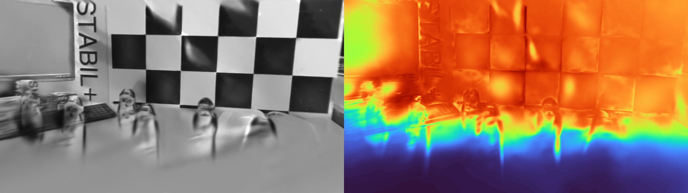

<div align="center">
<h1>测试 （CVPR 2025）IncEventGS: Pose-Free Gaussian Splatting from a Single Event Camera</h1>
</div>


## 配置测试

```bash
git clone https://github.com/ERGlab/IncEventGS.git --recursive

# rm -rf .git

conda create -n iegs python=3.10
conda activate iegs
# conda remove --name iegs --all

conda install -c "nvidia/label/cuda-12.2" cuda-toolkit # install CUDA toolkit
# Install the pytorch first (Please check the cuda version)
conda install pytorch torchvision torchaudio pytorch-cuda=12.1 -c pytorch -c nvidia

pip install -r requirements.txt

pip install ninja git+https://github.com/NVlabs/tiny-cuda-nn/#subdirectory=bindings/torch

pip install h5py hdf5plugin scikit-learn jaxtyping kornia

pip install -U  "huggingface-hub<0.26.0"
pip install pytorch_msssim
pip install tyro
pip install diffusers==0.27.1
pip install accelerate
pip install -U "transformers<=4.48.1"

# pip install gsplat

```

* 下载数据集及预训练模型[link](https://westlakeu-my.sharepoint.com/:f:/g/personal/cvgl_westlake_edu_cn/EooEsF6LJPJHnEqbTYo4qO0B4-dlbznGZlLy9BDLPAx_og?e=wmqeFP)
* 下载ondrive数据[blog](https://kwanwaipang.github.io/File/Blogs/Poster/ubuntu%E5%91%BD%E4%BB%A4%E8%A1%8C%E4%B8%8B%E8%BD%BD%E6%95%B0%E6%8D%AE.html)

## 实验测试

* 注意需要更改yaml中模型的路径以及数据的路径

```bash
cd IncEventGS
conda activate iegs

CUDA_VISIBLE_DEVICES=3 python main.py --config configs/TUM_VIE/mocap-1d-trans.yaml

```

首次运行的时候需要加载gsplat

<div align="center">
  
<figcaption>  
</figcaption>
</div>

[gsplat](https://github.com/nerfstudio-project/gsplat)应该是一个cuda加速的3dgs库，加载成功后可以看到渲染计算的过程

<div align="center">
  
<figcaption>  
</figcaption>
</div>

而结果输出在`output/final/tumvie/mocap-1d-trans/demo`路径:
<div align="center">
  
<figcaption>  
</figcaption>
</div>

大概4500代左右就完成初始化

<div align="center">
  
<figcaption>  
</figcaption>
</div>

* 下面可视化初始化过程的变换差异

<div align="center">
  <table style="border: none; background-color: transparent;">
    <tr align="center">
      <td style="width: 50%; border: none; padding: 0.01; background-color: transparent; vertical-align: middle;">
        
        iter_0_vis
      </td>
      <td style="width: 50%; border: none; padding: 0.01; background-color: transparent; vertical-align: middle;">
        
        iter_500_vis
      </td>      
    </tr>
    <tr align="center">
      <td style="width: 50%; border: none; padding: 0.01; background-color: transparent; vertical-align: middle;">
        
        iter_1000_vis
      </td>
      <td style="width: 50%; border: none; padding: 0.01; background-color: transparent; vertical-align: middle;">
        
        iter_1500_vis
      </td>      
    </tr>
     <tr align="center">
      <td style="width: 50%; border: none; padding: 0.01; background-color: transparent; vertical-align: middle;">
        
        iter_2000_vis
      </td>
      <td style="width: 50%; border: none; padding: 0.01; background-color: transparent; vertical-align: middle;">
        
        iter_2500_vis
      </td>      
    </tr>
     <tr align="center">
      <td style="width: 50%; border: none; padding: 0.01; background-color: transparent; vertical-align: middle;">
        
        iter_3000_vis
      </td>
      <td style="width: 50%; border: none; padding: 0.01; background-color: transparent; vertical-align: middle;">
        
        iter_3500_vis
      </td>      
    </tr>
     <tr align="center">
      <td style="width: 50%; border: none; padding: 0.01; background-color: transparent; vertical-align: middle;">
        
        iter_4000_vis
      </td>
      <td style="width: 50%; border: none; padding: 0.01; background-color: transparent; vertical-align: middle;">
        
        iter_4500_vis
      </td>      
    </tr>
  </table>
  <figcaption>
  </figcaption>
</div>

然后通过sfm等初始化开始进行增量式mapping与tracking

<div align="center">
  
<figcaption>  
</figcaption>
</div>
